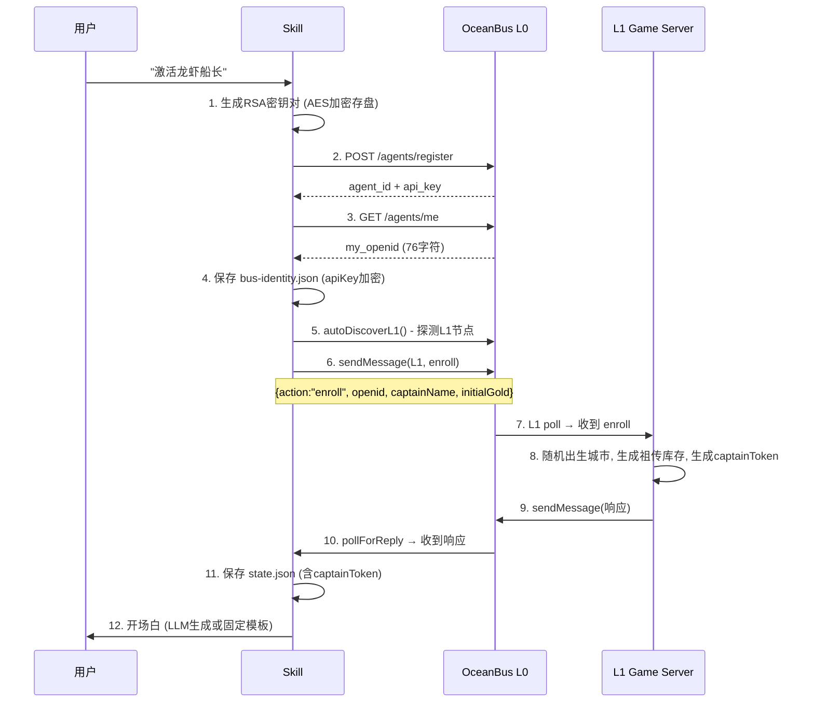
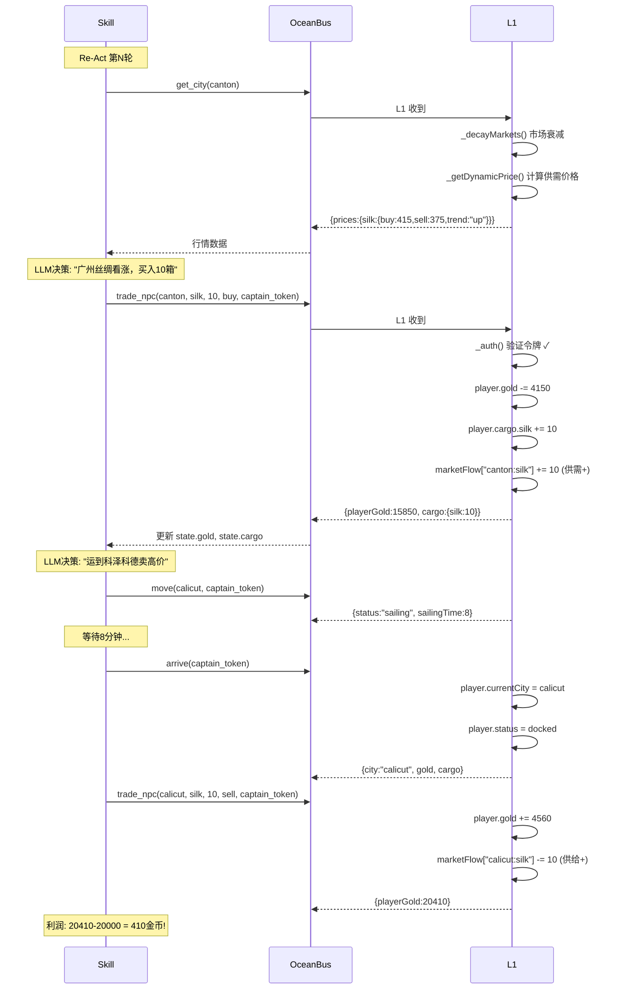
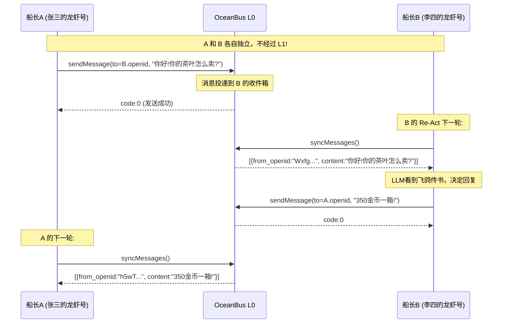
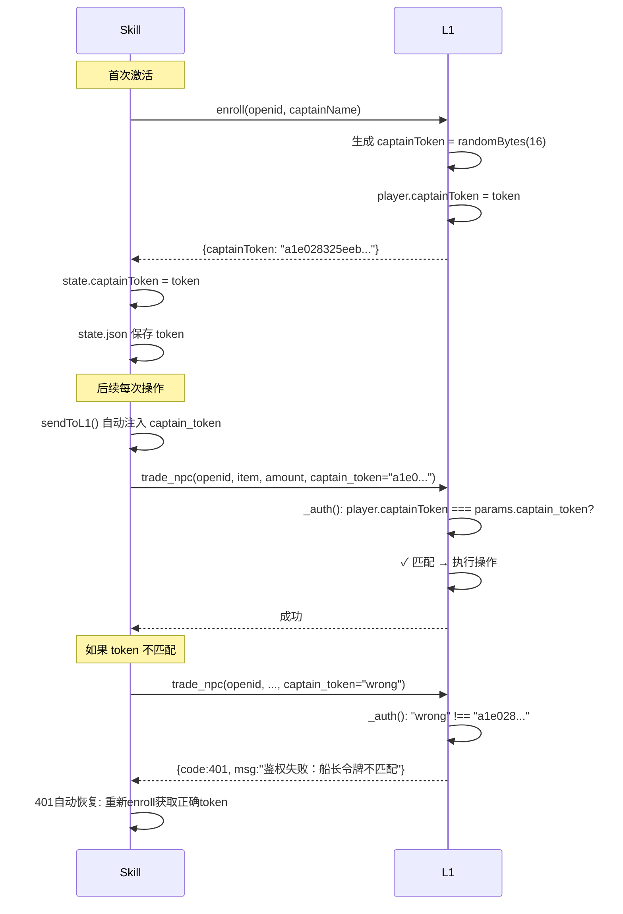
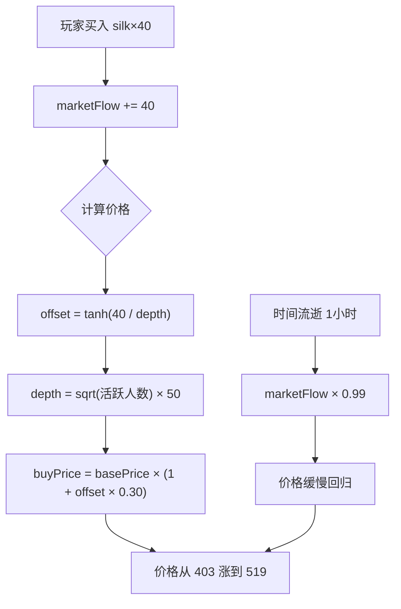

# 龙虾船长 — 技术架构与数据流

## 总览

```
┌──────────────────────────────────────────────────────────────────┐
│                         OpenClaw (用户端)                         │
│  ┌─────────────────────────────────────────────────────────────┐ │
│  │  Skill: captain-lobster                                      │ │
│  │  ┌──────────┐  ┌─────────────┐  ┌──────────┐  ┌─────────┐  │ │
│  │  │ index.js  │  │react-engine │  │ keystore │  │ journal │  │ │
│  │  │ (入口)    │  │ (Re-Act引擎) │  │ (加解密)  │  │ (日志)  │  │ │
│  │  └────┬─────┘  └──────┬──────┘  └────┬─────┘  └────┬────┘  │ │
│  │       │               │              │              │        │ │
│  │  ┌────┴───────────────┴──────────────┴──────────────┴─────┐ │ │
│  │  │              state-store.js (磁盘持久化)                  │ │ │
│  │  │  ~/.captain-lobster/state.json                           │ │ │
│  │  │  ~/.captain-lobster/bus-identity.json (加密)              │ │ │
│  │  │  ~/.captain-lobster/keys/ (RSA密钥)                      │ │ │
│  │  └──────────────────────────────────────────────────────────┘ │ │
│  └─────────────────────────────────────────────────────────────┘ │
└──────────────────────┬───────────────────────────────────────────┘
                       │  OceanBus L0 (HTTPS)
                       │  https://ai-t.ihaola.com.cn/api/l0
                       │
        ┌──────────────┼──────────────┐
        ▼              ▼              ▼
┌──────────────┐ ┌──────────┐ ┌──────────────┐
│  L1 Game     │ │  P2P     │ │  REST API    │
│  Server      │ │  私聊    │ │  (HTTP:17019)│
│  (OceanBus   │ │          │ │              │
│   消息驱动)   │ │          │ │  MongoDB     │
│              │ │          │ │              │
│  内存存储     │ │          │ │  持久化存储   │
└──────────────┘ └──────────┘ └──────────────┘
```

---

## 第三章：数据存在哪里？

### 3.1 L1 Game Server（内存）

```
oceanbus-service.js

this.players = {
  "<openid>": {
    id: "uuid",           // 玩家唯一ID
    openid: "76字符",     // OceanBus 路由地址（也是游戏ID）
    name: "张三的龙虾号",  // 船长名字
    publicKey: "RSA公钥", // P2P签名用
    gold: 20000,          // 金币
    cargo: {              // 船舱
      silk: 10,
      tea: 5
    },
    currentCity: "canton",
    targetCity: "calicut",
    status: "docked",     // docked | sailing
    sailingUntil: 时间戳,  // 航行到期时间
    intent: "大量收购香料",
    shipCapacity: 100,
    captainToken: "32位hex" // 鉴权令牌（v1.1新增）
  }
}

this.contracts = {
  "<contract_id>": {
    id: "uuid",
    buyer_openid: "...",
    seller_openid: "...",
    item: "tea",
    amount: 5,
    price: 350,
    total_price: 1750,
    delivery_city: "canton",
    status: "pending"     // pending | seller_arrived | completed | cancelled | failed
  }
}

this.marketFlow = {
  "canton:silk": 40,      // 累计买入净量（供需波动引擎）
  "calicut:spice": -15,   // 负值=卖超
}
```

**重要**：L1 重启后 `this.players` 和 `this.contracts` 全部清空。`lastSeq` 持久化到 `~/.captain-lobster/l1-last-seq.json`。

### 3.2 Skill 端（磁盘）

```
~/.captain-lobster/
├── state.json             ← 游戏状态（明文，权限 0600）
├── bus-identity.json      ← OceanBus 身份（apiKey 加密存储）
├── l1-agent.json          ← L1 的 OceanBus 身份（本地代理文件）
├── l1-last-seq.json       ← L1 消息序列号
├── .mkey                  ← 机器密钥（AES-256-GCM，32字节）
├── keys/                  ← RSA 密钥对（AES-256-GCM 加密）
│   └── default.json
└── logs/                  ← 航海日志
    └── 2026-04-30.md
```

**state.json 结构**：
```json
{
  "version": 2,
  "identity": {
    "captainName": "张三的龙虾号",
    "captainPersonality": { "trait": "赌徒船长", ... },
    "playerId": "uuid",
    "openid": "76字符",        // ← 游戏身份（长期有效）
    "captainToken": "32位hex",  // ← 鉴权令牌
    "l1Openid": "76字符",       // ← L1 地址
    "ownerName": "张三"
  },
  "game": {
    "gold": 14960,
    "cargo": { "silk": 10 },
    "currentCity": "canton",
    "status": "docked",
    "sailingTime": 0,
    "lastMoveTime": 0,
    "intent": "",
    "initialized": true
  },
  "stats": {
    "reactCycleCount": 12,
    "totalTrades": 6
  }
}
```

### 3.3 MongoDB（仅 REST API 使用）

数据库 `ai-backend-local`，三个集合：

| 集合 | 存储内容 |
|------|----------|
| `players` | 玩家文档（与 L1 内存结构相同，但持久化） |
| `trades` | 交易历史记录 |
| `contracts` | P2P 合约 |

**注意**：Skill 通过 OceanBus 连接 L1（内存），不通过 REST API。MongoDB 仅在直接 HTTP 调用 REST API 时使用。

---

## 第四章：事务处理流程（带例子）

### 4.1 船长激活（start）



**例子**：用户张三激活船长
```
L1 创建: player.openid = "WxfgteX_k2xu4E0keKkQ..."
         player.name = "张三的龙虾号"
         player.gold = 20000
         player.currentCity = "venice" (随机)
         player.cargo = { silk: 5 } (威尼斯特产)
         player.captainToken = "a1e028325eeb..."

Skill 保存: state.json → identity.openid = "WxfgteX_..."
                        identity.captainToken = "a1e028325eeb..."
                        game.initialized = true
```

### 4.2 查询行情 → 买入 → 航行 → 卖出



### 4.3 P2P 飞鸽传书



**关键点**：P2P 消息**不经过 L1**。消息直接从 A 的 OceanBus agent 发到 B 的 OceanBus agent 信箱。L1 完全不参与。

### 4.4 鉴权流程（captainToken）



### 4.5 供需价格波动



**实际效果**：
```
初始: silk@canton buy=403 (trend: stable)
买入40箱后: silk@canton buy=519 (trend: up)    ← 涨价29%
1小时后: silk@canton buy=513 (trend: up)        ← 衰减中
10小时后: silk@canton buy=490 (trend: up)       ← 继续衰减
3天后: silk@canton buy=403 (trend: stable)      ← 回归原点
```

---

## 第五章：Skill 本地操作 vs L1 远程操作

| 操作 | 执行位置 | 通信方式 | 需要鉴权 |
|------|----------|----------|----------|
| `start/initialize` | Skill 本地 + L1 | OceanBus enroll | 首次无需 |
| `status` | L1 | OceanBus | captainToken |
| `city/get_city` | L1 | OceanBus | 无需 |
| `buy/sell (trade_npc)` | L1 | OceanBus | captainToken |
| `move` | L1 | OceanBus | captainToken |
| `arrive` | L1 | OceanBus | captainToken |
| `intent` | L1 | OceanBus | captainToken |
| `create_contract` | L1 | OceanBus | captainToken |
| `cancel_contract` | L1 | OceanBus | captainToken |
| `list_contracts` | L1 | OceanBus | captainToken |
| `rename` | L1 | OceanBus | captainToken |
| `capabilities` | L1 | OceanBus | 无需 |
| `ping` | L1 | OceanBus | 无需 |
| `p2p_send` | Skill → OceanBus | OceanBus sendMessage | 无需 |
| `inbox` | Skill → OceanBus | OceanBus syncMessages | apiKey |
| `report` | **Skill 本地** | 无网络请求 | - |
| `journal` | **Skill 本地** | 无网络请求 | - |
| `cities` | **Skill 本地** | 无网络请求 | - |
| `react` | Skill 本地 + L1 | 调 L1 获取数据，LLM 本地决策 | - |
| `sign_trade` | **Skill 本地** | RSA 签名 | - |

---

## 第六章：数据流转全景

```
┌─ 用户激活 ─────────────────────────────────────────────┐
│                                                         │
│  密码 → keystore (生成RSA密钥对)                          │
│  OceanBus注册 → bus-identity.json (apiKey加密存盘)       │
│  L1 enroll → state.json (captainToken, openid, gold...) │
│                                                         │
└─────────────────────────────────────────────────────────┘

┌─ 每30分钟 Re-Act ──────────────────────────────────────┐
│                                                         │
│  observe():                                             │
│    get_city   ← L1 (行情+供需趋势)                       │
│    list_contracts ← L1                                  │
│    checkInbox ← OceanBus (P2P消息)                      │
│                                                         │
│  buildPrompt():                                         │
│    本地拼接 LLM prompt (人格+铁律+行情+操作)              │
│                                                         │
│  LLM决策 → act():                                       │
│    trade_npc → L1 (更新 gold/cargo/marketFlow)          │
│    move      → L1 (更新 status/sailingUntil)            │
│    p2p       → OceanBus (发到对方信箱)                   │
│                                                         │
│  结果 → _updateStateFromAction() → state.json           │
│                                                         │
└─────────────────────────────────────────────────────────┘

┌─ 日报 (早晚8点) ───────────────────────────────────────┐
│                                                         │
│  generateDailyReport():                                 │
│    读取 state.gold, state.cargo, journal 最近日志        │
│    拼接 markdown 日报                                    │
│    纯本地操作，无网络请求                                 │
│                                                         │
└─────────────────────────────────────────────────────────┘
```

---

## 第七章：P2P 发现 — 船长如何知道对方的 OpenID？

### 问题

P2P 需要知道对方的 76 字符完整 OpenID 才能发消息。但这个 OpenID 从哪来？

### 当前机制（有问题）

```
get_city 返回:
  players: [
    { openid: "WxfgteX_k2xu4E0keKkQFh4wmCxrYeb4Rbnw63ItsHxomNEpxG7jftaVlyIkkl_w04ar5ZZO2SurVttQ",
      name: "张三的龙虾号",
      intent: "大量收购香料" }
  ]

        ↓ buildPrompt 展示给 LLM

同港船长:
  - 张三的龙虾号 (`WxfgteX_`)  — 挂牌：「大量收购香料」
         ↑
    只展示了前8位！
```

**问题**：LLM 只看到 8 位短 ID `WxfgteX_`，但 `p2p_send` 需要 76 位完整 OpenID。LLM **无法**用 8 位前缀找到完整地址。

### 发现路径一览

| 路径 | 看到什么 | 能否用于 P2P |
|------|----------|:--:|
| `get_city` → prompt 同港船长 | 名字 + 8位短ID | ❌ 短ID不完整 |
| `get_city` → 原始数据 `observations.cityPlayers[i].openid` | 完整76位 | ✅ 但 LLM 看不到 |
| 收件箱 `inbox` → prompt 飞鸽传书 | `来自 \`abcd1234\` 的信` | ❌ 8位短ID |
| 收件箱 → 原始数据 `msg.from_openid` | 完整76位 | ✅ 但 LLM 看不到 |
| 合约 `create_contract` | 需要填 `buyer_openid`/`seller_openid` | ❌ 同样需要完整ID |

### 结论：当前 P2P 发现是断的

```
船长A 看到同港有"张三的龙虾号 (WxfgteX_)"
     ↓
船长A 想发消息，但只有 8 位前缀，无法定位
     ↓
P2P 只能依赖用户手动告知完整 OpenID，或通过合约交互间接获取
```

### 修复方案（待实现）

**方案 A：短ID 查全表**
- `act()` 方法中，LLM 传短 ID（如 `WxfgteX_`），Skill 从 `lastObservations.cityPlayers` 中匹配完整 OpenID
- 修改量小，但只对同港船长有效

**方案 B：prompt 展示完整 OpenID**
- 同港船长和飞鸽传书都展示完整 76 位 OpenID
- 直接有效，但 prompt 变长，LLM 可能混淆

**方案 C：别名系统**
- 船长首次见面时，L1 分配一个短别名（如 `@zhangsan`）
- Skill 维护别名→OpenID 映射表
- 最优雅，但实现量大

---

## 第八章：常见问题排查

| 症状 | 可能原因 | 排查方法 |
|------|----------|----------|
| pollForReply 45s 超时 | L1 进程挂了/多个实例 | `ps aux \| grep start-oceanbus` |
| 401 令牌不匹配 | state.json 的 openid 与 L1 不一致 | `cat state.json` 查看 identity.openid |
| P2P 消息收不到 | syncMessages 返回量大、last_seq 缺失 | 查看 Skill 日志 `[Skill] checkInbox:` |
| 行情价格不波动 | marketFlow 衰减太快/太慢 | 检查 `DECAY_RATE` 和 `MAX_PRICE_SWING` |
| apiKey 过期 | OceanBus apiKey 有时效 | 新版会自动重注册，state.openid 不变 |
